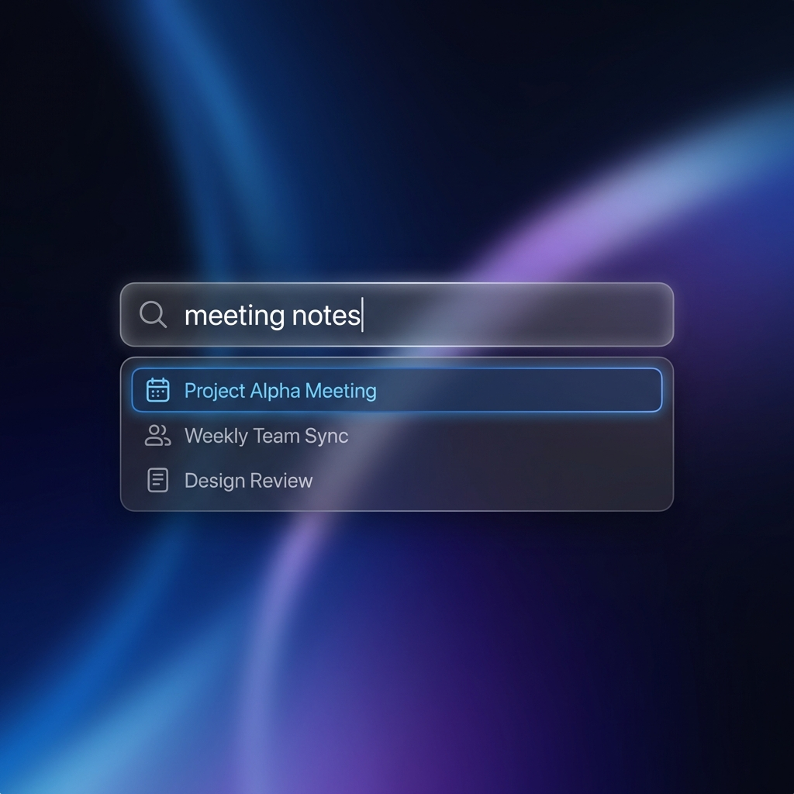
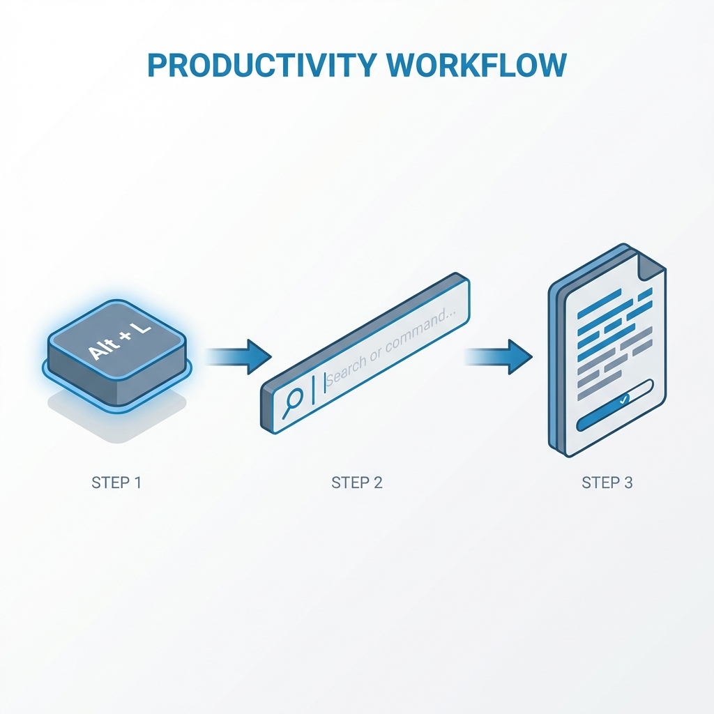

# MiNote WebView

**Turn your scattered thoughts into an instantly accessible knowledge base.**


*Use `Alt + L` to summon your knowledge base instantly.*

MiNote WebView is more than just a desktop client; it's a powerful interface for your Xiaomi Cloud Notes. By combining a global hotkey with high-performance fuzzy search, it allows you to summon your notes instantly over any application, transforming "write-and-forget" data into a productivity asset that is always at your fingertips.

## 🚀 The Core Workflow



### 1. **Summon (`Alt + L`)**
No matter what you're doing—coding, writing reports, or browsing—simply press **`Alt + L`**. The MiNote Launch Bar appears instantly in the center of your screen, ready for input.

### 2. **Fuzzy Search**
Start typing anything you remember: a keyword, a title fragment, or even a partial sentence.
*   **Smart Matching**: Our fuzzy search algorithm finds the most relevant notes, prioritizing title matches and recent modifications.
*   **Real-time Results**: See search results update instantly as you type, even with hundreds of notes.

### 3. **Action**
Navigate the results with your arrow keys and hit **Enter**.
*   **Auto-Paste**: The content of the selected note is automatically pasted into your active application.
*   **Copy to Clipboard**: (Configurable) Alternatively, have the content copied to your clipboard for manual use.

## ✨ Key Features

*   **Native Experience**: Enjoy the full official Xiaomi Cloud Notes web interface in a dedicated, high-performance window, free from browser clutter.
*   **Seamless Synchronization**: Your notes are always up-to-date. The application runs a background process that utilizes your login session to keep local data synchronized in real-time.
*   **Distraction-Free**: When not in use, the app minimizes to the system tray, keeping your taskbar clean while remaining just one shortcut away.
*   **Zero Configuration**: Just log in to your Xiaomi account within the app, and the background system automatically handles authentication and data fetching.

## 📦 Getting Started

### Installation
Currently, the application is built from source.

1.  Ensure you have [Rust](https://www.rust-lang.org/) installed.
2.  Clone this repository.
3.  Run the application:
    ```bash
    cargo run --release
    ```

### Usage
1.  **First Launch**: Log in to your Xiaomi Cloud account in the window that appears.
2.  **Background Sync**: Once logged in, the app automatically starts fetching your notes.
3.  **Go Global**: Minimize the window. Use `Alt + L` anytime to search and use your notes.

## 📄 License
[MIT License](LICENSE)
